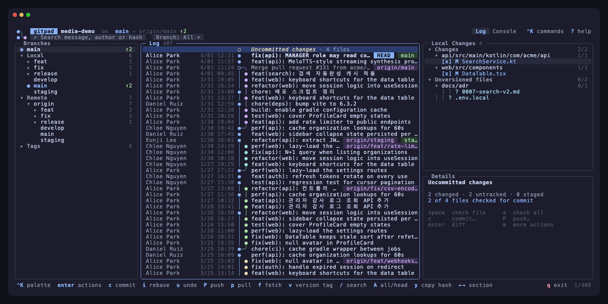
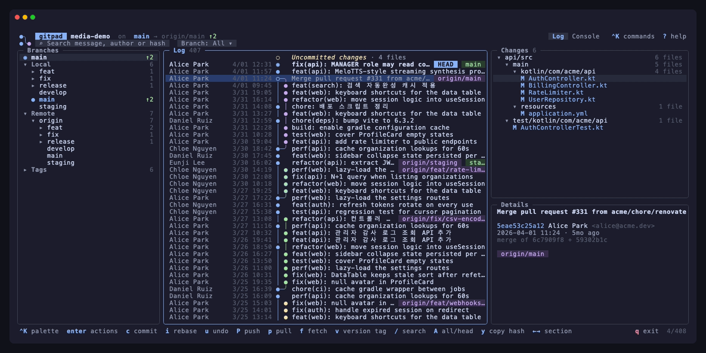
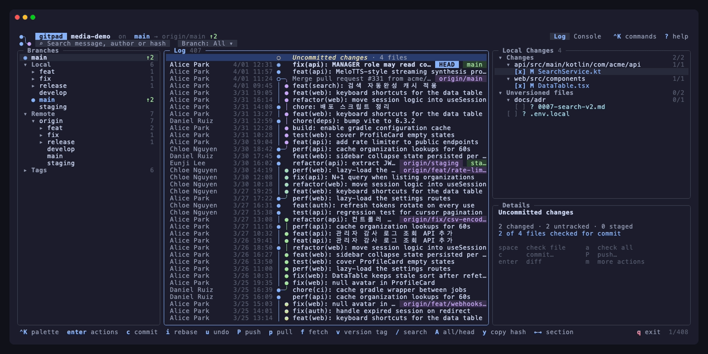
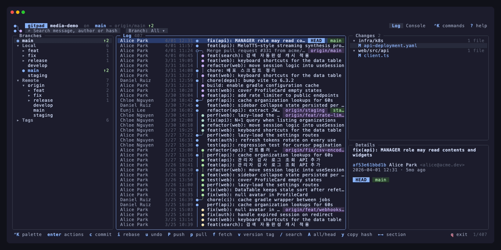
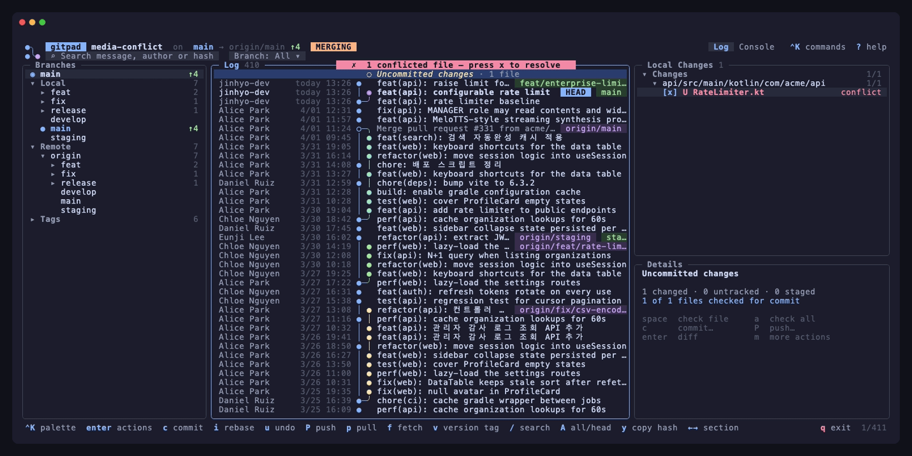
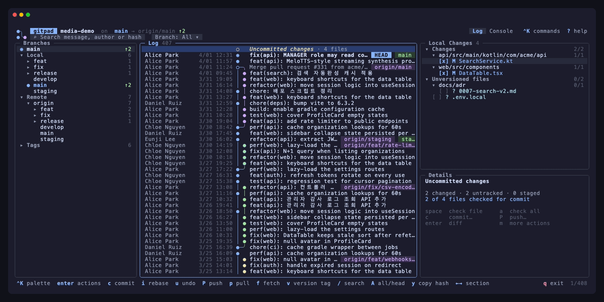
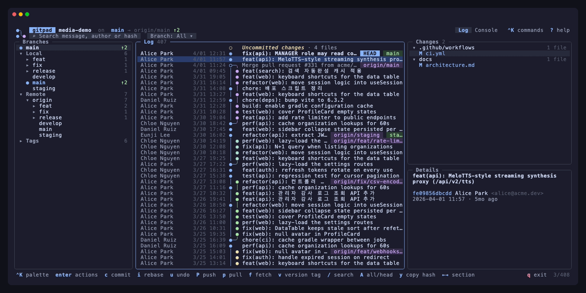
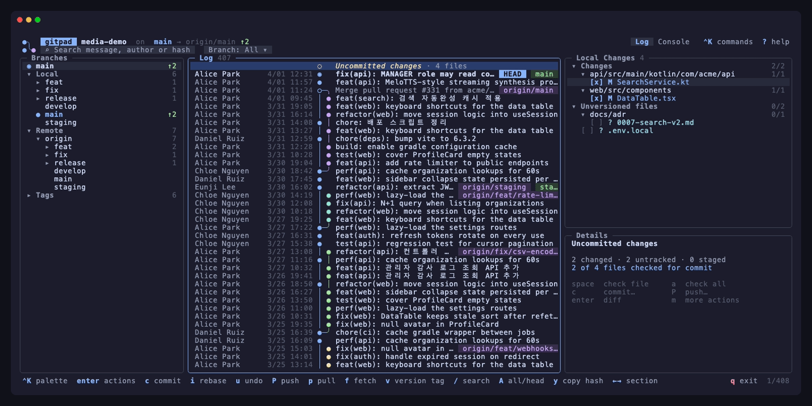

# gitpad

A Git log & branch manager for the terminal.

**Website & interactive demo:** [gitpad.jinhyo.dev](https://gitpad.jinhyo.dev/) ([한국어](https://gitpad.jinhyo.dev/ko/))

gitpad puts the whole picture on one screen: a branch tree on the left, a
colored commit graph in the middle, the changed files and commit details on
the right — with right-click (or `Enter`) context menus for
checkout, merge, rebase, cherry-pick, revert, reset, branch/tag creation,
and a built-in diff viewer.

<p align="center">
  
</p>

<sub>Every recording below comes from a synthetic repository generated by
<code>scripts/demo-repo</code> — the authors, messages and history are fictional.</sub>

## Features

### Log, graph & branches
Commit graph with lanes and ref chips, a branch tree with ahead/behind
counters, and the changed files and details of the selected commit — plus
GitHub check status (✓ ✗ ◌) next to every commit when a token is available.


### Context menus
`enter` or right-click on any commit or branch: checkout, cherry-pick, revert,
reset (soft / mixed / hard), new branch or tag, merge, rebase, push, delete.



### Commit workspace & hunk staging
Check files — or individual hunks in the diff preview — write a multi-line
message with history recall, and commit or commit & push. Only what you
checked is committed; the rest stays in the working tree.



### Interactive rebase
Pick, reword, edit, squash, fixup, drop and reorder from the log. Rewords are
applied without opening an editor; conflicts hand over to the resolver.



### Conflict resolution
Ours, theirs or both per conflict block — the discarded side is crossed out —
then save, mark resolved and continue the merge or rebase.



### Push dialog
See exactly which commits will be pushed, get warned when the branch is
behind, toggle force-with-lease or tags.



### Command palette
`ctrl+k` lists every action for the current selection; type to filter,
`enter` to run.



### Undo
`u` walks back the last commit, rebase, reset, checkout or deletion — and
tells you what it is about to do first.


### Search & branch picker
One box for messages, authors and hashes, and a type-to-filter branch picker.



## Install

**macOS — Homebrew**

```sh
brew tap jinhyo-dev/gitpad https://github.com/jinhyo-dev/gitpad
brew install --cask gitpad
```

**Debian / Ubuntu — apt**

```sh
curl -fsSL https://jinhyo-dev.github.io/gitpad/apt/key.gpg | sudo gpg --dearmor -o /usr/share/keyrings/gitpad.gpg
echo "deb [signed-by=/usr/share/keyrings/gitpad.gpg] https://jinhyo-dev.github.io/gitpad/apt stable main" | sudo tee /etc/apt/sources.list.d/gitpad.list
sudo apt-get update && sudo apt-get install gitpad
```

`.rpm` and `.apk` packages are attached to every [release](https://github.com/jinhyo-dev/gitpad/releases).

**Windows — Scoop**

```powershell
scoop bucket add gitpad https://github.com/jinhyo-dev/gitpad
scoop install gitpad
```

Plain archives for every platform are on the [releases page](https://github.com/jinhyo-dev/gitpad/releases).

**Go**

```sh
go install github.com/jinhyo-dev/gitpad@latest
```

Then, inside any repository:

```sh
gitpad            # current directory
gitpad ~/src/app  # explicit path
```

gitpad needs a `git` binary on `PATH`. It shells out to your git, so hooks,
credential helpers, GPG signing and every `.gitconfig` setting behave exactly
as on the command line.

## Layout

| Pane | Content |
|---|---|
| **Branches** | HEAD, Local (grouped by `/`), Remote (per remote), Tags — with ahead/behind counters |
| **Log** | Commit graph, author, date, CI status (✓ ✗ ◌), subject, ref chips; an *Uncommitted changes* row on top when the tree is dirty |
| **Changes** | Files changed by the selected commit (or the working tree), as a compacted directory tree |
| **Details** | Full message, hash, author, date, refs |

The search box matches commit messages **and** author names; **branch** and
**path** filters sit next to it. Typing a hash prefix jumps straight to that commit.

The header shows the gitpad logo as an inline image in terminals that support
the iTerm2 or Kitty graphics protocols (iTerm2, WezTerm, Kitty, Ghostty,
Warp) and a text mark elsewhere. `GITPAD_LOGO=text|off|iterm|kitty` overrides
the detection.

## Keys

| Key | Action |
|---|---|
| `ctrl+k` | command palette — type to find any action (global + selected commit / branch / file) |
| `tab` `1` `2` `3` `h` `l` | switch pane |
| `j` `k` `g` `G` `ctrl+d` `ctrl+u` | move / page |
| `enter` `m` / right-click | context menu (commit, branch, file) |
| `space` | fold / unfold tree nodes |
| `←` `→` | fold / unfold; on a leaf (or nothing left to fold) move to the previous / next pane |
| `/` | search message, author or hash · `A` all branches ↔ current · `esc` clear |
| `↑` / `↓` | past the top of a pane → search bar · past the last file → Details pane |
| `↑` / `↓` in a diff | jump to the next / previous change block · `shift+↑↓` scroll by line · `n` / `p` next / prev file |
| `←` / `→` in the filter bar | move between the search box and the **Branch** chip; `enter` on the chip opens a type-to-filter branch picker, `esc` clears the branch filter |
| `c` / `C` | checkout (branches) · commit workspace (elsewhere / anywhere) |
| `space` / `a` | check a file / all files for commit (local changes) |
| `s` | show branch in log (branches) |
| `d` | delete branch/tag (branches) · discard file (local files) |
| `H` | show the file's history in the log |
| `o` / `O` | open the file with the OS default app (images, PDFs, docs — a commit's version is extracted) / reveal it in the file manager |
| `i` | interactive rebase from the selected commit |
| `u` | undo the last history-changing operation |
| `x` | resolve merge conflicts |
| `y` | copy hash / path / name |
| `f` `p` `P` | fetch · pull chooser · push dialog |
| `v` | new version tag (patch / minor / major) + push |
| `ctrl+s` `ctrl+p` | commit · commit & push (in the commit workspace) |
| `` ` `` | console: every git command gitpad ran, with output |
| `r` | refresh (the view also auto-refreshes when the repository changes) |
| `?` | help · `q` quit |

Mouse: click to select, double-click to open, right-click for the menu,
wheel to scroll — in any terminal that reports mouse events (iTerm2,
Terminal.app, Warp, kitty, WezTerm, IDE terminals…).

### Commit actions

Checkout revision · New branch/tag here · Cherry-pick · Revert · Reset
(soft/mixed/hard) · Undo last commit · per-branch submenu (checkout, merge
into current, rebase current onto, push, rename, delete) · Copy hash ·
Open in browser.

### CI status

When `origin` points at GitHub and a token is available (`GH_TOKEN`,
`GITHUB_TOKEN`, or a logged-in `gh` CLI), every commit shows its combined
check status — ✓ passed, ✗ failed, ◌ running — fetched in batches through the
GraphQL API and refreshed while checks are running. The Details pane lists the
individual checks with durations; *Open checks in browser* is in the commit
menu. Other hosts (GitLab, Gitea…) are planned.

### Commit workspace (`c` / `C`)

The log pane turns into a commit view: a checklist of changed
files grouped into **Changes** and **Unversioned files**, a multi-line
message editor, and *Commit* / *Commit & Push* buttons; the right column
previews the diff of the highlighted file.

- `enter` (or `space`) checks a file — or a whole folder / group — and `a`
  checks everything. `tab`, `1 2 3` or `→` move between the file list, the
  message and the diff preview.
- **Hunk staging**: in the diff preview `↑`/`↓` move between hunks and
  `space` checks or unchecks the current one (`a` toggles the whole file);
  a partially checked file shows `[~]` with its hunk count. Only the checked
  hunks are committed — the rest stays in the working tree, like `git add -p`.
  Tracked changes are checked by default, unversioned files are not.
- Checkboxes are gitpad's own selection: the index is not touched until you
  commit, and then only the checked files are committed
  (`git commit --only -- <files>`).
- `tab` moves to the message; `↑` on the first line recalls your
  recent commit messages; `ctrl+s` commits, `ctrl+p` commits and opens the
  push dialog.

### Interactive rebase (`i`)

Select a commit in the log and press `i` (or *Interactive rebase from here…*
in its menu): every commit from there up to HEAD opens as an editable plan.
`p r e s f d` set pick / reword / edit / squash / fixup / drop, `shift+↑↓`
reorder, `enter` opens the row menu, `ctrl+s` starts after a confirmation.
Rewords are applied without opening an editor; conflicts or `edit` stops show
the REBASING badge with *Continue* / *Abort* in the changes menu, and the old
history stays reachable as `ORIG_HEAD`.

### Conflict resolution (`x`)

When a merge, rebase, cherry-pick or revert stops on conflicts, gitpad says
so and `x` (or `enter` on a conflicted file) opens the resolver: the file with
every `<<<<<<<` block highlighted — ours in blue, theirs in purple, the
diff3 base when present. Per block, `o` keeps ours, `t` theirs, `b` / `B` both
in either order, `O` / `T` decide every block at once; `↑↓` move between
blocks. `ctrl+s` writes the file and marks it resolved, moves on to the next
conflicted file, and offers to continue the operation once all are done.

### Undo (`u`)

Every history-changing operation gitpad performs — commit, rebase, reset,
cherry-pick, revert, merge, pull, checkout, branch or tag deletion — records
where HEAD was. `u` shows what undoing the last one would do and reverts it:
commits are undone with `reset --soft` (the changes stay staged), rewrites with
`reset --keep` (refused rather than overwriting local edits), switches by
checking the previous branch out again, deletions by re-creating the ref. The
stack lives for the session; git's reflog remains the safety net beyond that.

### Push dialog (`P`)

Shows the target (`main → origin/main`, or the upstream that will be
created), the list of commits that will be sent, a warning when the branch
is behind its upstream, and *Force with lease* / *Push tags* toggles.

### Tags & releases (`v`)

`v` proposes the next **patch / minor / major** version based on your latest
`vX.Y.Z` tag, asks for an optional annotation (annotated tag when given,
lightweight otherwise), creates the tag on HEAD and offers to push it right
away — which is all a tag-driven release pipeline needs. Tags in the Branches
pane have *Push tag* / *Delete tag on origin* actions, and any commit's menu
has *New tag here…*.

### Pull (`p`)

A small chooser — *Pull (merge)*, *Pull (rebase)*, *Fetch only* — that
remembers your last choice and defaults to `pull.rebase` from your config.

### Working tree actions

Stage/unstage · Stash / unstash · Discard · per-file diff and discard ·
Continue/abort an in-progress merge, rebase, cherry-pick or revert.

Destructive operations (hard reset, force push, discard, branch deletion)
always ask for confirmation.

## Development

```sh
make test        # unit + integration tests (spins up a temporary repository)
make snapshot    # render one frame as plain text for layout debugging
make build       # ./gitpad
make demo-repo   # synthetic ~400-commit repository in /tmp/gitpad-demo
make media       # re-record docs/media/*.gif + docs/screenshots/*.png with vhs
make release-check  # validate .goreleaser.yaml
```

Releases are cut by pushing a tag: `git tag v0.1.0 && git push origin v0.1.0`.
The release workflow builds the binaries and packages, commits the Homebrew
cask (`Casks/`) and Scoop manifest (`bucket/`) back to `main`, and publishes
the apt repository to the `gh-pages` branch — pull `main` after a release.

Structure:

```
main.go                 entry point (flags, snapshot mode)
internal/git            git CLI wrapper: log/refs/status/diff parsing, actions
internal/graph          commit-graph lane layout (one row per commit)
internal/ui             bubbletea model: panels, menus, dialogs, diff viewer
internal/ui/theme       palette & styles (Catppuccin-inspired, light fallbacks)
internal/ui/overlay     ANSI-aware compositing for popups (CJK-width safe)
site/                   website (Vite+ · React · Tailwind, EN/KO, interactive demo)
scripts/demo-repo       generator for the anonymous demo repository (screenshots)
scripts/apt-*.sh        apt repository signing key + index builder (release workflow)
docs/tapes/*.tape       vhs scripts, one per feature, that record the README media
Casks/, bucket/         Homebrew cask and Scoop manifest, written by the release workflow
```

## Roadmap

- Side-by-side diff with syntax highlighting
- Interactive rebase (reorder / squash / fixup from the log)
- Hunk-level selection in the commit workspace, conflict resolution helpers
- Amend / sign-off toggles, commit message templates
- Stash list panel, CI status column
