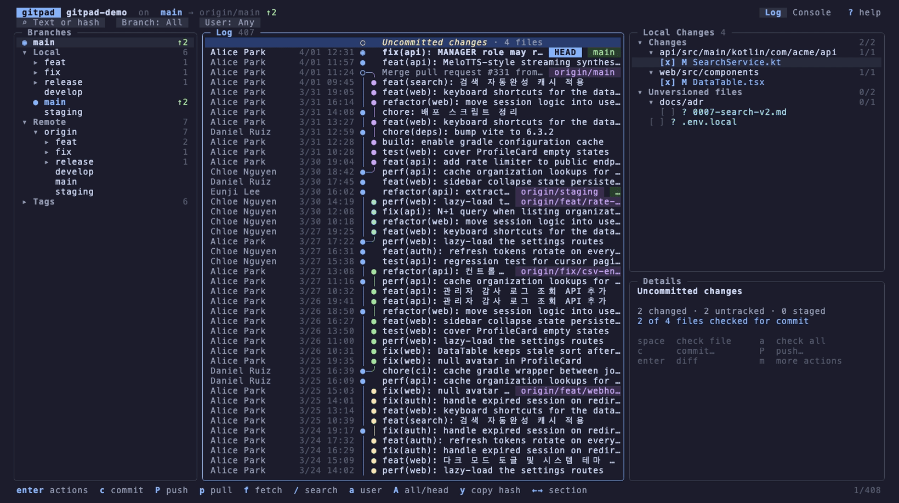
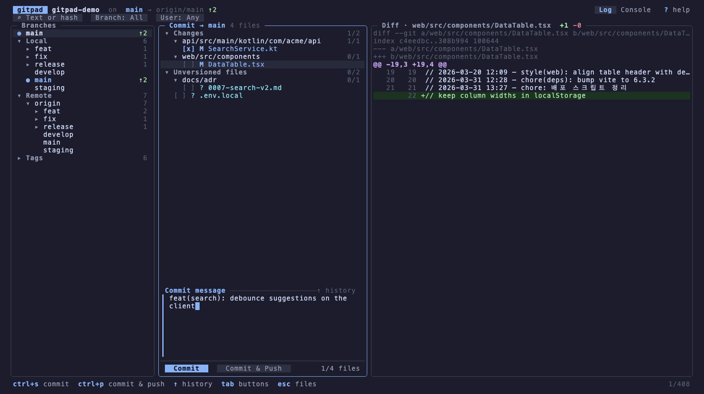
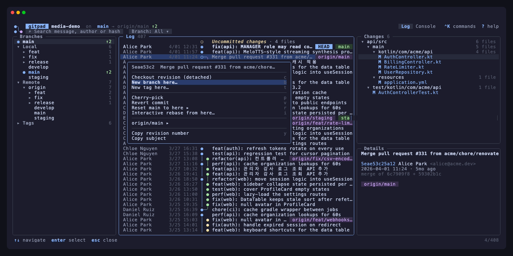
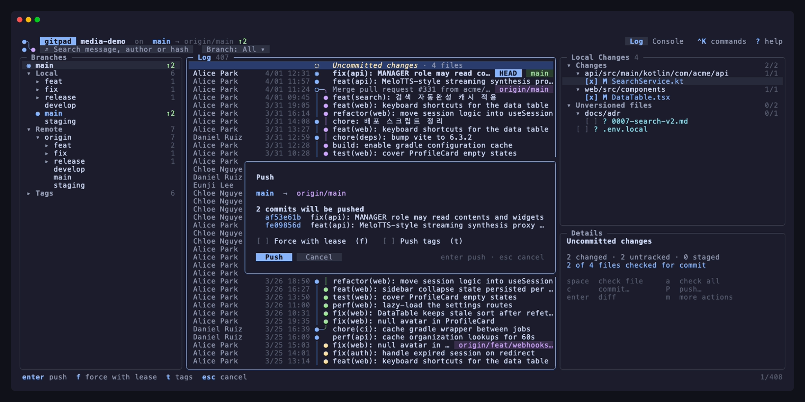

# gitpad

A Git log & branch manager for the terminal.

gitpad puts the whole picture on one screen: a branch tree on the left, a
colored commit graph in the middle, the changed files and commit details on
the right — with right-click (or `Enter`) context menus for
checkout, merge, rebase, cherry-pick, revert, reset, branch/tag creation,
and a built-in diff viewer.

<p align="center">
  
</p>

| Log & branches | Commit workspace |
|---|---|
|  |  |
| **Commit actions** | **Push dialog** |
|  |  |

<sub>All screenshots come from a synthetic repository generated by
<code>scripts/demo-repo</code> — the authors, messages and history are fictional.</sub>

## Install

**macOS — Homebrew**

```sh
brew tap jinhyo-dev/gitpad https://github.com/jinhyo-dev/gitpad
brew install --cask gitpad
```

**Debian / Ubuntu — apt**

```sh
curl -fsSL https://jinhyo-dev.github.io/gitpad/apt/key.gpg | sudo gpg --dearmor -o /usr/share/keyrings/gitpad.gpg
echo "deb [signed-by=/usr/share/keyrings/gitpad.gpg] https://jinhyo-dev.github.io/gitpad/apt stable main" | sudo tee /etc/apt/sources.list.d/gitpad.list
sudo apt-get update && sudo apt-get install gitpad
```

`.rpm` and `.apk` packages are attached to every [release](https://github.com/jinhyo-dev/gitpad/releases).

**Windows — Scoop**

```powershell
scoop bucket add gitpad https://github.com/jinhyo-dev/gitpad
scoop install gitpad
```

Plain archives for every platform are on the [releases page](https://github.com/jinhyo-dev/gitpad/releases).

**Go**

```sh
go install github.com/jinhyo-dev/gitpad@latest
```

Then, inside any repository:

```sh
gitpad            # current directory
gitpad ~/src/app  # explicit path
```

gitpad needs a `git` binary on `PATH`. It shells out to your git, so hooks,
credential helpers, GPG signing and every `.gitconfig` setting behave exactly
as on the command line.

## Layout

| Pane | Content |
|---|---|
| **Branches** | HEAD, Local (grouped by `/`), Remote (per remote), Tags — with ahead/behind counters |
| **Log** | Commit graph, author, date, CI status (✓ ✗ ◌), subject, ref chips; an *Uncommitted changes* row on top when the tree is dirty |
| **Changes** | Files changed by the selected commit (or the working tree), as a compacted directory tree |
| **Details** | Full message, hash, author, date, refs |

The search box matches commit messages **and** author names; **branch** and
**path** filters sit next to it. Typing a hash prefix jumps straight to that commit.

## Keys

| Key | Action |
|---|---|
| `tab` `1` `2` `3` `h` `l` | switch pane |
| `j` `k` `g` `G` `ctrl+d` `ctrl+u` | move / page |
| `enter` `m` / right-click | context menu (commit, branch, file) |
| `space` | fold / unfold tree nodes |
| `←` `→` | fold / unfold; on a leaf (or nothing left to fold) move to the previous / next pane |
| `/` | search message, author or hash · `A` all branches ↔ current · `esc` clear |
| `↑` / `↓` | past the top of a pane → search bar · past the last file → Details pane |
| `↑` / `↓` in a diff | jump to the next / previous change block · `shift+↑↓` scroll by line · `n` / `p` next / prev file |
| `←` / `→` in the filter bar | move between the search box and the **Branch** chip; `enter` on the chip opens a type-to-filter branch picker, `esc` clears the branch filter |
| `c` / `C` | checkout (branches) · commit workspace (elsewhere / anywhere) |
| `space` / `a` | check a file / all files for commit (local changes) |
| `s` | show branch in log (branches) |
| `d` | delete branch/tag (branches) · discard file (local files) |
| `H` | show the file's history in the log |
| `y` | copy hash / path / name |
| `f` `p` `P` | fetch · pull chooser · push dialog |
| `V` | new version tag (patch / minor / major) + push |
| `ctrl+s` `ctrl+p` | commit · commit & push (in the commit workspace) |
| `` ` `` | console: every git command gitpad ran, with output |
| `r` | refresh (the view also auto-refreshes when the repository changes) |
| `?` | help · `q` quit |

Mouse: click to select, double-click to open, right-click for the menu,
wheel to scroll — in any terminal that reports mouse events (iTerm2,
Terminal.app, Warp, kitty, WezTerm, IDE terminals…).

### Commit actions

Checkout revision · New branch/tag here · Cherry-pick · Revert · Reset
(soft/mixed/hard) · Undo last commit · per-branch submenu (checkout, merge
into current, rebase current onto, push, rename, delete) · Copy hash ·
Open in browser.

### CI status

When `origin` points at GitHub and a token is available (`GH_TOKEN`,
`GITHUB_TOKEN`, or a logged-in `gh` CLI), every commit shows its combined
check status — ✓ passed, ✗ failed, ◌ running — fetched in batches through the
GraphQL API and refreshed while checks are running. The Details pane lists the
individual checks with durations; *Open checks in browser* is in the commit
menu. Other hosts (GitLab, Gitea…) are planned.

### Commit workspace (`c` / `C`)

The log pane turns into a commit view: a checklist of changed
files grouped into **Changes** and **Unversioned files**, a multi-line
message editor, and *Commit* / *Commit & Push* buttons; the right column
previews the diff of the highlighted file.

- `enter` (or `space`) checks a file — or a whole folder / group — and `a`
  checks everything. `tab`, `1 2 3` or `→` move between the file list, the
  message and the diff preview; there `↑`/`↓` jump between change blocks
  (`shift+↑`/`↓` scroll by line).
  Tracked changes are checked by default, unversioned files are not.
- Checkboxes are gitpad's own selection: the index is not touched until you
  commit, and then only the checked files are committed
  (`git commit --only -- <files>`).
- `tab` moves to the message; `↑` on the first line recalls your
  recent commit messages; `ctrl+s` commits, `ctrl+p` commits and opens the
  push dialog.

### Push dialog (`P`)

Shows the target (`main → origin/main`, or the upstream that will be
created), the list of commits that will be sent, a warning when the branch
is behind its upstream, and *Force with lease* / *Push tags* toggles.

### Tags & releases (`V`)

`V` proposes the next **patch / minor / major** version based on your latest
`vX.Y.Z` tag, asks for an optional annotation (annotated tag when given,
lightweight otherwise), creates the tag on HEAD and offers to push it right
away — which is all a tag-driven release pipeline needs. Tags in the Branches
pane have *Push tag* / *Delete tag on origin* actions, and any commit's menu
has *New tag here…*.

### Pull (`p`)

A small chooser — *Pull (merge)*, *Pull (rebase)*, *Fetch only* — that
remembers your last choice and defaults to `pull.rebase` from your config.

### Working tree actions

Stage/unstage · Stash / unstash · Discard · per-file diff and discard ·
Continue/abort an in-progress merge, rebase, cherry-pick or revert.

Destructive operations (hard reset, force push, discard, branch deletion)
always ask for confirmation.

## Development

```sh
make test        # unit + integration tests (spins up a temporary repository)
make snapshot    # render one frame as plain text for layout debugging
make build       # ./gitpad
make demo-repo   # synthetic ~400-commit repository in /tmp/gitpad-demo
make demo        # re-record docs/demo.gif + docs/screenshots with vhs
make release-check  # validate .goreleaser.yaml
```

Releases are cut by pushing a tag: `git tag v0.1.0 && git push origin v0.1.0`.
The release workflow builds the binaries and packages, commits the Homebrew
cask (`Casks/`) and Scoop manifest (`bucket/`) back to `main`, and publishes
the apt repository to the `gh-pages` branch — pull `main` after a release.

Structure:

```
main.go                 entry point (flags, snapshot mode)
internal/git            git CLI wrapper: log/refs/status/diff parsing, actions
internal/graph          commit-graph lane layout (one row per commit)
internal/ui             bubbletea model: panels, menus, dialogs, diff viewer
internal/ui/theme       palette & styles (Catppuccin-inspired, light fallbacks)
internal/ui/overlay     ANSI-aware compositing for popups (CJK-width safe)
scripts/demo-repo       generator for the anonymous demo repository (screenshots)
scripts/apt-*.sh        apt repository signing key + index builder (release workflow)
docs/demo.tape          vhs script that records the README media
Casks/, bucket/         Homebrew cask and Scoop manifest, written by the release workflow
```

## Roadmap

- Side-by-side diff with syntax highlighting
- Interactive rebase (reorder / squash / fixup from the log)
- Hunk-level selection in the commit workspace, conflict resolution helpers
- Amend / sign-off toggles, commit message templates
- Stash list panel, CI status column
